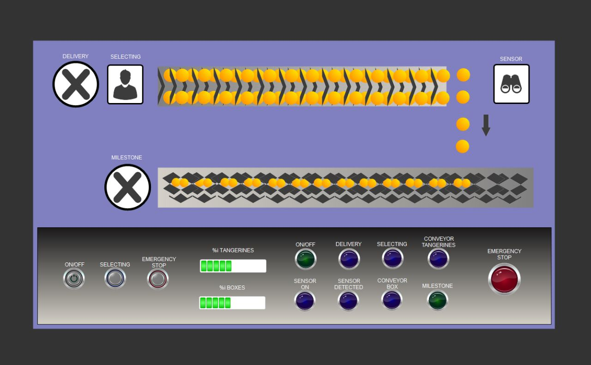

# Second Exam 2023 - 1st Semester

## Equipo de Trabajo

- [Sergio Andres Amortegui Ardila](https://www.linkedin.com/in/sergioamar/) - 0000203657
- [Juan David Forero Rodriguez](https://www.linkedin.com/in/juanforo/) - 0000201946
- [Nadiv Esteban Mejia Morales](https://www.linkedin.com/in/nadivmejia/) - 0000204301

## 1. Análisis de la Problemática

Fruver 1A S.A, una comercializadora de mandarinas busca aumentar su produccion para desarrollarse y competir al nivel de comercializadoras internacionales. Por lo cual, propone la automatización de la línea de operación de segmentación, empaquetado y entrega de mandarinas, mediante un sistema que permita mantener control y calidad para asegurar la cantidad, calidad y entrega requerida.

## 2. Diseño de la Solución

Identificando los aspectos claves para plantear un sistema automatizado que cumpla con las necesidades y expectativas de comercializar mandarinas, se identificaron los siguientes aspectos:

1. El objetivo diario es entregar 100 paquetes de mandarinas.
2. Cada paquete debe contar con 50 mandarinas.
3. No se debe requerir de intervension de personal a la hora de llenar los paquetes de mandarinas.

Por lo cual, buscando mantener una correcta segmentacion y empaquetado de las mandarinas, se divira el sistema en 5 flujos, los cuales cumplen una unica funcion basica, buscando control y calidad en la entrega de mandarinas, mediante su cuantificacion y empaquetado, evitando desperdicios y/o empaquetado de mandarinas fuera de lo inicialmente pactado, los flujo son presentados a continuacion.

### 2.1 Flujo del Sistema

Flujo dedicado a la recopilacion del cargamento de mandarinas, desempacado, seleccion de mandarinas, transporte de mandarinas, deteccion y cuenta de mandarinas, transporte de cajas y entrega de paquetes.

#### 2.1.1 Flow #0 - Cargamento

Proceso encargado de recibir, almacenar y actualizar el estado del cargamento entrante de mandarinas. Un agente es el encargado de la recoleccion y almacenamiento de las mandarinas.

#### 2.1.2 Flow #1 - Descarga y Seleccion

Proceso delegado de descargar las mandarinas y llevarlas a la linea de transporte, seleccionando las mandarinas que cumplan con los estandares de calidad requeridos. Un agente es el encargado de la seleccion de las mandarinas.

#### 2.1.3 Flow #2 - Transporte de Mandarinas

Proceso encargado de transportar las mandarinas seleccionadas desde el punto de seleccion del agente hasta el punto de deteccion de mandarinas.

#### 2.1.4 Flow #3 - Deteccion y Cuenta de Mandarinas

Proceso encargado de identificar y contar las mandarinas que pasan por el punto de deteccion, actualizando el estado del sistema para detener o activar las bandas de transporte.

#### 2.1.5 Flow #4 - Transporte de Cajas

Proceso encargado de transportar las cajas pasando desde el punto de deteccion hasta el punto de entrega.

### 2.2 Diagrama de Flujo

El flujo resultante de los segmentos analizados y definidos, se presenta a continuacion.

## 3. Modelo de Simulación

Bajo la plataforma Codesys se desarrollo un sistema automatizado y simulado bajo el lenguaje ladder, que suple las necesidades escenciales para Fruver 1A S.A, mediante la implementacion de los diferentes flujos identificados en el analisis de la problematica, incluyendo en cada uno de ellos estados, variables y eventos que permiten el correcto funcionamiento del sistema. Ademas, mediante una HMI (Human Machine Interface) se permite la interaccion con el usuario, permitiendo el inicio, paro, reinicio del sistema y la visualizacion de los estados y variables del sistema por medio de indicadores y animaciones.

### 3.1 Programación Ladder

#### 3.1.1 Red #1

Esta red simula el tiempo requerido para la descarga de las mandarinas, mediante el uso de un timer que simula la espera requerida para concretar dicho procedimiento. Una vez se complete el tiempo de espera se activa la variables `.is_loaded`, que permite proceder con el flujo del sistema.

#### 3.1.2 Red #2

Esta red cuenta con dos _Inputs_, `.is_on` & `.is_selecting`, las cuales una vez se activan, permiten el inicio del proceso de seleccion de mandarinas.

#### 3.1.3 Red #3

En este punto, se utiliza un timer a través del cual se simuló el tiempo requerido para que una mandarina avance desde el inicio de la cinta transportadora hasta el final de la misma, esto con el fin de conocer después de cuanto tiempo encender el sensor encargado de la detección de mandarinas.

#### 3.1.4 Red #4

Llegados a esta red, el sensor infrarrojo se enciende, y cuenta con un tiempo de espera definido por la variable `_tangerines_fall_delay`, este tiempo referencia el espacio existente desde que pasa una mandarina por el sensor hasta que pasa la siguiente mandarina, y activa la variable `.is_tagerine_detected` para que se pueda restablecer y proceder con el flujo del sistema.

#### 3.1.5 Red #5

Esta red tiene como función generar un tiempo de espera pequeño, determinado por `.t_restart_detection_delay`, y posteriormente reiniciar el detector de mandarinas, de esta forma nos asesoramos que el relay interno del sensor se encuentre restablecido.

#### 3.1.6 Red #6

Al llegar a esta red nos encontramos con un contador ascendente (CTU), este será el encargado de contar la cantidad de mandarinas que han pasado por el sensor a lo largo del tiempo, y al llegar al valor definido por la variable `.n_tangerines_per_boxes` activará la segunda cinta transportadora con la siguiente caja vacía, y detendrá la primera cinta para que no caigan mandarinas durante el proceso de ubicar la nueva caja.

#### 3.1.7 Red #7

Similar a la red anterior, nos encontramos con un CTU, pero en lugar de contar mandarinas, este se encargará de llevar la cuenta de la totalidad de cajas llenadas durante la sesión de trabajo del sistema, la cantidad de cajas objetivo, o "milestone", se almacenará en la variable `.n_tangerines_per_boxes` y una vez alcanzado este objetivo, se activará la variable `.is_milestone`.

#### 3.1.8 Red #8

El timer mostrado en esta red es el encargado de reiniciar el sistema de conteo de las cajas, de forma que cuando se llene una nueva caja, esta se agregara correctamente al contador. Sin este timer, el contador no recibiría un cambio de flanco, y por tanto, no contaría una nueva entrada.

#### 3.1.9 Red #9

Esta red es la encargada de volver a iniciar la cinta transportadora de mandarinas y otros elementos, después de que las cajas se hayan terminado de mover y la nueva caja este a disposición para la primera cinta transportadora.

#### 3.1.10 Red #10

algo

#### 3.1.11 Red #11

algo

#### 3.1.12 Red #12

algo

### Human Machine Interface (HMI)

La HMI permite la interaccion con el usuario, permitiendo el inicio, paro, reinicio del sistema y la visualizacion de los estados y variables del sistema por medio de indicadores y animaciones.

## 4. Implementación

Bajo la aproximacion trabajada en el modelo de simulacion, la construccion e implementacion de la solucion a un protipo fisico implico el uso de diverso materiales como:

1. Arduino UNO
2. Servomotores
3. Bateria
4. Cableado y Conectores
   1. Sensor Infrarrojo

### 4.1 Diagrama de Circuito Eléctrico

## 5. Anexos

### 5.1 Tipos

| Tipo   | Convención |
| :----- | :--------- |
| `BOOL` | is\_       |
| `INT`  | n\_        |
| `TIME` | t\_        |
| `TON`  | ton\_      |
| `ET`   | et\_       |
| `CTU`  | ctu\_      |

### 5.2 Definicion de Variables

#### 5.2.1 Variables de Proceso

Define las variables empleadas en el proceso de automatizacion de la linea de operacion de segmentacion, empaquetao y entrega de mandarinas.

| Sección    | Variable                   | Tipo   | Valor Inicial | Operación | Descripción                                                              |
| :--------- | :------------------------- | :----- | :------------ | :-------- | :----------------------------------------------------------------------- |
| `Global`   | is_on                      | `BOOL` | 0             | `Input`   | Define el estado de inicio del sistema                                   |
| `Global`   | is_stop                    | `BOOL` | 0             | `Input`   | Define el estado de parada de emergencia del sistema                     |
| `Global`   | is_new_box                 | `BOOL` | 0             | `Output`  | Define el estado que indica si una nueva caja se ha completado           |
| `Global`   | is_milestone               | `BOOL` | 0             | `Output`  | Define el estado de si se ha cumplido el objetivo de cajas del dia       |
| `Global`   | is_fresh_start             | `BOOL` | 0             | `Output`  | Define el estado de si es el primer inicio del sistema                   |
| `Global`   | is_reset_box_counter       | `BOOL` | 0             | `Output`  | Define el estado de si se debe reiniciar la cuenta de cajas              |
| `Global`   | is_reset_tangerine_counter | `BOOL` | 0             | `Output`  | Define el estado de si se debe reiniciar la cuenta de mandarinas         |
| `Global`   | n_box_counter              | `INT`  | 0             | `Output`  | Define la cantidad actual de cajas completadas                           |
| `Global`   | n_tangerine_counter        | `INT`  | 0             | `Output`  | Define la cantidad actual de manadarinas dentro de una caja              |
| `Global`   | n_tangerines_per_boxes     | `INT`  | 0             | `Output`  | Define la cantidad de mandarinas maximas por caja                        |
| `Global`   | n_boxes_daily_milestone    | `INT`  | 0             | `Output`  | Define la cantidad de cajas minimas para completar el objetivo diario    |
| `Flow #0`  | is_loaded                  | `BOOL` | 0             | `Output`  | Define el estado de si completo la entrega de mandarinas                 |
| `Flow #1`  | is_selecting_tangerines    | `BOOL` | 0             | `Input`   | Define el estado de si el agente esta seleccionando mandarinas           |
| `Flow #2`  | is_moving_tangerines       | `BOOL` | 0             | `Output`  | Define el estado de si la banda transportadora de mandarinas esta activa |
| `Flow #3`  | is_sensor_active           | `BOOL` | 0             | `Output`  | Define el estado de si el sensor infrarojo esta activo                   |
| `Flow #3`  | is_tangerine_detected      | `BOOL` | 0             | `Output`  | Define el estado de si una mandarina fue detectada cayendo a la caja     |
| `Flow #4`  | is_moving_boxes            | `BOOL` | 0             | `Output`  | Define el estado de si la banda tranportadora de cajas esta activa       |
| `Counters` | ctu_tangerines             | `CTU`  | 0             | `Output`  | Define la cantidad actual de mandarinas dentro de la caja                |
| `Counters` | ctu_boxes                  | `CTU`  | 0             | `Output`  | Define la cantidad actual de cajas completadas                           |

#### 5.2.2 Variables de Simulación

Define las variables empleadas en el proceso de las simulacion de automatizacion de la linea de operacion de segmentacion, empaquetao y entrega de mandarinas.

| Sección   | Variable                    | Tipo   | Valor Inicial | Operación | Descripción                                                                                                   |
| :-------- | :-------------------------- | :----- | :------------ | :-------- | :------------------------------------------------------------------------------------------------------------ |
| `Flow #0` | t_delivery_delay            | `TIME` | T#5S          | `Output`  | Define el tiempo de espera que simula la entrega de mandarinas                                                |
| `Flow #2` | t_tangerines_conveyor_delay | `TIME` | T#5S          | `Output`  | Define el tiempo de espera que simula el movimiento de la banda transportadora de naranjas                    |
| `Flow #3` | is_tangerine_not_detected   | `BOOL` | 0             | `Output`  | Define el estado de si una mandarina fue detectada cayaendo a la caja (negada)                                |
| `Flow #3` | t_tangerines_fall_delay     | `TIME` | T#5S          | `Output`  | Define el tiempo de espera que simula la caida de las mandarinas                                              |
| `Flow #3` | t_restart_detection_delay   | `TIME` | T#5S          | `Output`  | Define el tiempo de espera que simula el tiempo entre caida de mandarinas                                     |
| `Flow #4` | t_boxes_conveyor_delay      | `TIME` | T#5S          | `Output`  | Define el tiempo de espera que simula el movimiento de la banda transportadora de cajas                       |
| `Flow #4` | t_restart_new_box_delay     | `TIME` | T#5S          | `Output`  | Define el tiempo de espera que simula el tiempo entre cajas completadas                                       |
| `Timers`  | ton_delivery                | `TON`  | ?             | `Output`  | Define el timer que actua como delay para simular la entrega de las mandarinas                                |
| `Timers`  | et_delivery                 | `TIME` | ?             | `Output`  | Define el tiempo actual para el timer `ton_delivery`                                                          |
| `Timers`  | ton_conveyor_tangerines     | `TON`  | ?             | `Output`  | Define el timer que actua como delay para simular el movimiento de la banda transportadora de mandarinas      |
| `Timers`  | et_conveyor_tangerines      | `TIME` | ?             | `Output`  | Define el tiempo actual para el timer `ton_conveyor_tangerines`                                               |
| `Timers`  | ton_tangerine_detector      | `TON`  | ?             | `Output`  | Define el timer que actua como delay para simular el tiempo de deteccion entre mandarinas                     |
| `Timers`  | et_tangerine_detector       | `TIME` | ?             | `Output`  | Define el tiempo actual para el timer `ton_tangerine_detector`                                                |
| `Timers`  | ton_conveyor_boxes          | `TON`  | ?             | `Output`  | Define el timer que actua como delay para simular el tiempo de movimiento de la banda transportadora de cajas |
| `Timers`  | et_conveyor_boxes           | `TIME` | ?             | `Output`  | Define el tiempo actual para el timer `ton_conveyor_boxes`                                                    |
| `Timers`  | ton_restart_detection       | `TON`  | ?             | `Output`  | Define el timer que actua como delay para reiniciar el timer `ton_conveyor_tangerines`                        |
| `Timers`  | et_restart_detection        | `TIME` | ?             | `Output`  | Define el tiempo actual para el timer `ton_restart_detection`                                                 |
| `Timers`  | ton_restart_new_box         | `TON`  | ?             | `Output`  | Define el timer que actua como delay para reiniciar el timer `ton_conveyor_boxes`                             |
| `Timers`  | et_restart_new_box          | `TIME` | ?             | `Output`  | Define el tiempo actual para el timer `ton_restar_new_box`                                                    |
